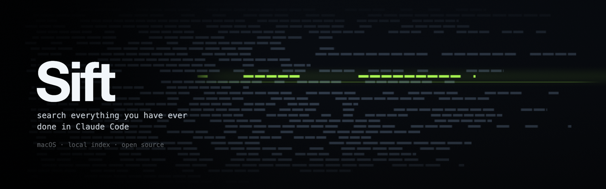
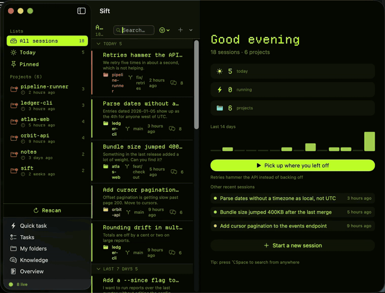

<p align="center">
  
</p>

<p align="center">
  
  
  
</p>

Claude Code writes every session to a transcript on your Mac. After a few months that is
thousands of files you cannot search, so the work is effectively gone: you remember solving
something and have no way back to it.

Sift indexes those transcripts and makes them searchable in milliseconds. Find the session,
read it, and pick it back up in your own terminal.

<p align="center">
  
</p>

<p align="center"><em>The library, a search, the knowledge graph, a session opened and a
loop — one theme each.</em></p>

Search, resume, quick tasks, scheduled tasks and loops all run against local files and a
local SQLite index. One optional feature, knowledge extraction, does send transcript text
out; it ships switched off and there is a section about it below.

---

## What it does

**Search.** Full-text search across every session, ranked, with highlighted excerpts. Filter
by project, git branch, or date. On a 6,000-session library a query returns in about 30 ms.

**Resume.** Open any session back up in your own terminal, in the right working directory,
with your own shell setup.

**Quick tasks.** Run a one-off `claude -p` prompt in a folder without opening a terminal and
watch the answer stream in. Save the prompts you repeat.

**Scheduled tasks and loops.** Run a prompt on a schedule while the app is open. Or run a
*loop*: a maker does the work, a separate checker grades it against your definition of done,
and it repeats until it passes or runs out of attempts, keeping the evidence for each attempt.

**Knowledge graph.** Off by default. Sift extracts durable facts and entities from finished
sessions into a local store and draws the result as a graph, so connections across projects
are visible instead of buried. See [What leaves your machine](#what-leaves-your-machine) first.

---

## What leaves your machine

Indexing, search, and resuming all read local files and write a local database. Nothing in
that path talks to the network.

**Knowledge extraction is the exception, and it is off until you turn it on** in
Settings → Knowledge. Once on, each finished session is sent to `claude -p` under your own
Claude account so facts can be pulled out of it. Two things follow from that:

- Transcript text goes over the network to Anthropic, exactly as if you had pasted it into
  Claude yourself. Up to 60,000 characters per session.
- It spends your tokens. One extra `claude` run per session you finish, paced so a backlog
  cannot fire all at once.

While it is on, Sift also does two things worth knowing about. It adds its knowledge MCP
server and a short project digest to sessions it launches, which costs a little context on
each run. And each extraction run creates a transcript of its own, which Sift deletes from
`~/.claude/projects` afterwards so it does not clutter your `claude --resume` picker. That
deletion is the only write Sift makes inside Claude Code's own directory.

Turning the switch off stops all of it. Nothing already extracted is sent anywhere; delete
`brain.sqlite` to discard it.

---

## Appearance

Five designs in Settings → Appearance, switched live:

| Theme | What it is |
|---|---|
| System | Follows macOS. Your light or dark setting, your accent colour. |
| Graphite | Neutral dark, low colour. |
| Ocean | Deep blue, rounded type. |
| Paper | Light and warm, serif, for reading long transcripts. |
| Terminal | Phosphor green on near-black, monospaced, with the CRT glow Sift started out with. |

Views read named tokens rather than fixed colours, so a new theme is one value in
`Sources/SiftViews/Theme/SiftTheme.swift` and it appears in the picker on its own.

Everything shown above is generated data, not anyone's real sessions. `scripts/demo-data.py`
writes a throwaway transcript tree and knowledge graph, and `SIFT_PROJECTS_ROOT` /
`SIFT_SUPPORT_DIR` point a build at it:

```sh
python3 scripts/demo-data.py /tmp/sift-demo/projects
SIFT_PROJECTS_ROOT=/tmp/sift-demo/projects SIFT_SUPPORT_DIR=/tmp/sift-demo/support \
  /Applications/Sift.app/Contents/MacOS/Sift      # quit once it has indexed
python3 scripts/demo-data.py --brain-only /tmp/sift-demo/support
```

`scripts/record-tour.sh` is what recorded the animation, and `docs/banner.html` is the
WebGPU shader the header image was rendered from: open it, and it draws live.

---

## Getting Sift

Sift is not in an app store, so you build it once on your own machine. You do not need to
know how to program; you copy a few lines into a terminal and wait. Pick your platform.

<details>
<summary><strong>macOS</strong></summary>

**1. Install the tools you need.** Open the Terminal app (press ⌘Space, type `Terminal`,
press Return) and paste this, then press Return:

```sh
xcode-select --install
```

If a window appears, click Install and wait for it to finish. If it says the tools are
already installed, you are fine.

**2. Build Sift.** Paste these three lines into the same window, one at a time:

```sh
git clone https://github.com/kasparovabi/sift.git
cd sift
./scripts/install.sh
```

The last line takes a few minutes. When it prints `Installed: /Applications/Sift.app`, Sift
is in your Applications folder like any other app.

**3. Open it.** The first launch reads your existing sessions; a large library takes about a
minute, once. After that it starts instantly.

</details>

<details>
<summary><strong>Windows</strong></summary>

**1. Install the tool you need.** Open PowerShell (press the Start button, type
`PowerShell`, click it) and paste this, then press Return:

```powershell
winget install Microsoft.DotNet.SDK.8
```

Close PowerShell and open it again afterwards, so it picks up what was just installed.

**2. Build Sift.** Paste these three lines, one at a time:

```powershell
git clone https://github.com/kasparovabi/sift.git
cd sift
dotnet publish windows-winui\SiftWinUI.csproj -c Release -r win-x64 -o publish
```

The last line takes a few minutes and prints a lot; that is normal.

**3. Open it.** Double-click `Sift.exe` in the `publish` folder that was created. Windows
will warn that the app is unrecognised, because it is not signed by a company: click **More
info**, then **Run anyway**. Right-click `Sift.exe` and choose *Pin to Start* if you want it
somewhere easy to reach.

Everything Sift needs is inside that folder, so it works on a machine with nothing else
installed. The folder is about 265 MB for that reason.

</details>

<details>
<summary><strong>Linux, or any machine, in a browser</strong></summary>

**1. Check you have Node 22 or newer.** In a terminal:

```sh
node --version
```

If that prints something lower than `v22`, or an error, install Node from
[nodejs.org](https://nodejs.org).

**2. Run Sift.** Paste these three lines:

```sh
git clone https://github.com/kasparovabi/sift.git
cd sift
node web/sift.mjs
```

It reads your sessions and opens Sift in your browser. Leave that terminal window open while
you use it; closing it stops Sift.

</details>

### What you need either way

- [Claude Code](https://claude.com/claude-code), installed and signed in. Sift reads the
  sessions Claude Code has already saved on your machine; without it there is nothing to
  read.
- macOS 14 or later, Windows 10 or 11, or any Linux with Node 22.

### Why there is no download button

A downloadable app has to be signed, which means paying Apple or a certificate authority
every year. Building it yourself costs nothing, and it means you can see exactly what you
are running.

---

## Where each version lives

| Folder | What it is |
|---|---|
| the repository root | the macOS app, SwiftUI |
| `windows-winui/` | the Windows app, WinUI 3 |
| `web/` | the browser version, for Linux or anything else |

They are separate programs rather than one program ported around, because SwiftUI only
exists on Apple platforms. They read the same session files and keep the same kind of search
index, so they behave the same.

`windows/` holds an earlier Windows build using WPF, kept until the WinUI one has been run
on more machines.

---

## Unlimited retention

Claude Code deletes transcripts older than `cleanupPeriodDays`, 30 by default. Sift keeps its
own copy of every transcript it indexes, so a session Claude Code has since removed stays
searchable and readable, and it offers to turn the cleanup off so the originals stay
resumable too. Resuming an archived session puts the transcript back on disk first, because
`claude --resume` looks for it there.

---

## Building and hacking on it

```sh
swift build -c release          # the macOS app
swift test
./scripts/make-app.sh release   # assemble Sift.app without installing

dotnet test windows-winui/Sift.Tests/Sift.Tests.csproj    # the Windows core
node --test web/test/sift.test.mjs                        # the browser version
```

A Swift 6 toolchain (Xcode 16 or the standalone toolchain) builds the macOS app; the .NET 8
SDK builds the Windows one. [Ghostty](https://ghostty.org) is optional on macOS: sessions
open there when it is installed and in Terminal.app otherwise, and neither asks for a
permission.

Two consequences of the ad-hoc signature on macOS, worth knowing before filing a bug:

- macOS ties Files-and-Folders permissions to a signing identity, and an ad-hoc one changes
  on every rebuild. Grant a prompt, reinstall, and macOS asks again. That is the signature
  changing, not a bug.
- Launch-at-login needs the app in `/Applications`. The Settings toggle reports the error
  rather than silently snapping back.

---

## How it works

Sift reads the transcripts Claude Code already writes to `~/.claude/projects` and keeps a
SQLite index (FTS5, BM25 ranking) beside them. The index is a cache: delete it and it rebuilds
from the transcripts, which stay the source of truth.

Sessions are not embedded in the app. Opening one launches `claude --resume <id>` in your own
terminal, so an open session costs nothing while you are not using it and you keep your own
prompt, fonts and keybindings.

Data lives in `~/Library/Application Support/Sift`:

| File | What it is | Size, roughly |
|---|---|---|
| `index.sqlite` | Session index and full-text search. Rebuildable. | About 160 KB per session: 5,000 sessions came to 836 MB on the machine this was built on |
| `brain.sqlite` | Extracted knowledge and the entity graph. Not rebuildable. | A few MB |
| `loops.sqlite` | Loop definitions and their evidence. | Small |

The index is full-text, so it holds a searchable copy of your transcripts. That is where the
size comes from. Delete it whenever you like; the next launch rebuilds it.

If either database ever fails to open, Sift moves it aside as `<name>.sqlite.corrupt` and
starts a fresh one instead of refusing to launch. It tells you when this happens, and the
damaged file is kept rather than deleted.

Sift reads a directory layout that belongs to Claude Code, not to Sift. If a Claude Code
release changes where transcripts live or what is in them, indexing can break until Sift
catches up. Please open an issue with your `claude --version` when that happens.

---

## Status

One person maintains this, in spare time, on one Mac. It has been used daily against a
5,000-session library, and CI builds and tests every push, but it has not been run against
many different setups yet. Bug reports with the versions filled in are the fastest way to
change that. If an issue sits for a while, it means the week got busy, not that the project
is abandoned.

---

## Not affiliated with Anthropic

Sift is an independent tool that works alongside Claude Code. It is not an Anthropic product
and is not endorsed by Anthropic. "Claude" and "Claude Code" are trademarks of Anthropic.

## License

MIT. See [LICENSE](LICENSE).
