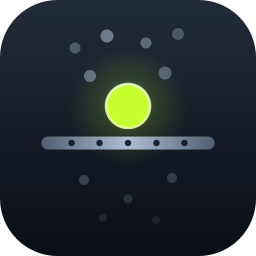
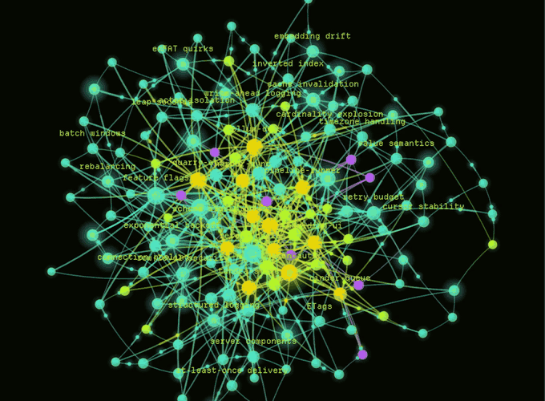
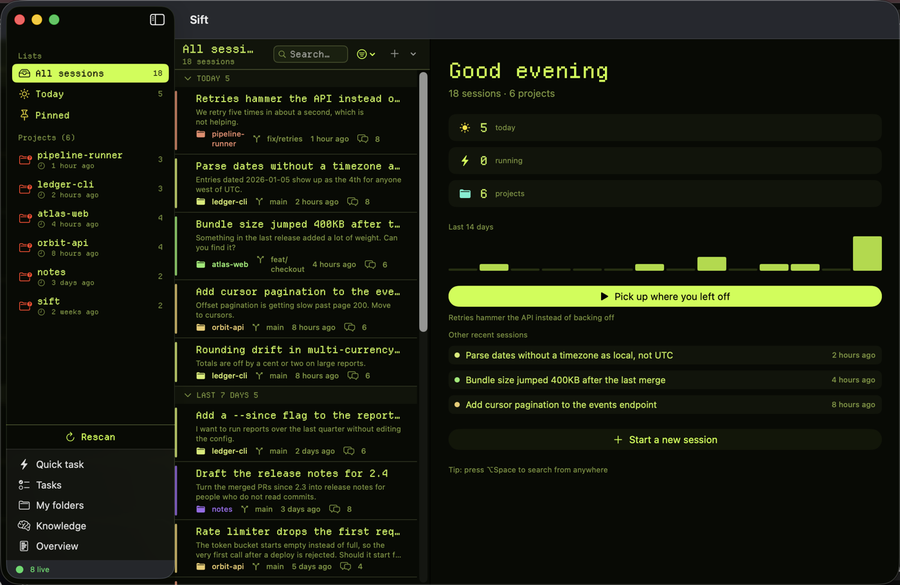
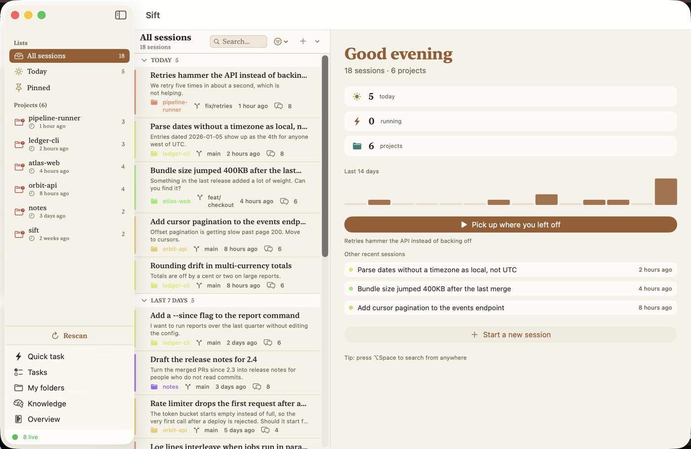
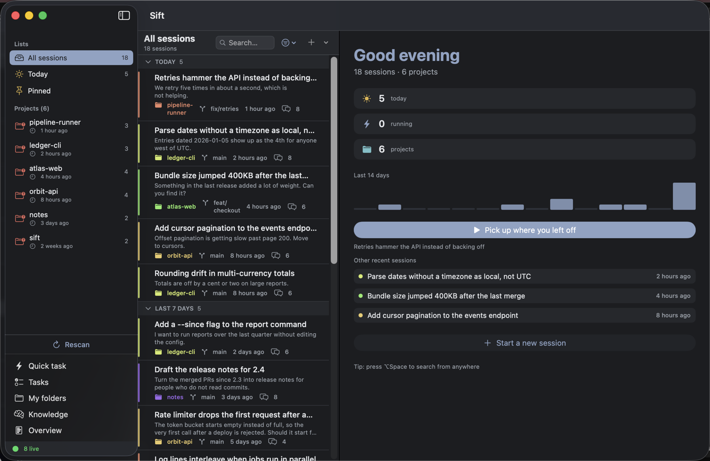

<p align="center">
  
</p>

<h1 align="center">Sift</h1>

<p align="center"><strong>Search everything you have ever done in Claude Code.</strong></p>

<p align="center">
  
  
  
</p>

Claude Code writes every session to a transcript on your Mac. After a few months that is
thousands of files you cannot search, so the work is effectively gone: you remember solving
something and have no way back to it.

Sift indexes those transcripts and makes them searchable in milliseconds. Find the session,
read it, and pick it back up in your own terminal.

<p align="center">
  
</p>

<p align="center"><em>The knowledge graph, built from what your sessions actually decided.
Optional, and off until you turn it on.</em></p>

Search, resume, quick tasks, scheduled tasks and loops all run against local files and a
local SQLite index. One optional feature, knowledge extraction, does send transcript text
out; it ships switched off and there is a section about it below.

---

## What it does

**Search.** Full-text search across every session, ranked, with highlighted excerpts. Filter
by project, git branch, or date. On a 6,000-session library a query returns in about 30 ms.

**Resume.** Open any session back up in your own terminal, in the right working directory,
with your own shell setup.

**Quick tasks.** Run a one-off `claude -p` prompt in a folder without opening a terminal and
watch the answer stream in. Save the prompts you repeat.

**Scheduled tasks and loops.** Run a prompt on a schedule while the app is open. Or run a
*loop*: a maker does the work, a separate checker grades it against your definition of done,
and it repeats until it passes or runs out of attempts, keeping the evidence for each attempt.

**Knowledge graph.** Off by default. Sift extracts durable facts and entities from finished
sessions into a local store and draws the result as a graph, so connections across projects
are visible instead of buried. See [What leaves your Mac](#what-leaves-your-mac) first.

---

## What leaves your Mac

Indexing, search, and resuming all read local files and write a local database. Nothing in
that path talks to the network.

**Knowledge extraction is the exception, and it is off until you turn it on** in
Settings → Knowledge. Once on, each finished session is sent to `claude -p` under your own
Claude account so facts can be pulled out of it. Two things follow from that:

- Transcript text goes over the network to Anthropic, exactly as if you had pasted it into
  Claude yourself. Up to 60,000 characters per session.
- It spends your tokens. One extra `claude` run per session you finish, paced so a backlog
  cannot fire all at once.

While it is on, Sift also does two things worth knowing about. It adds its knowledge MCP
server and a short project digest to sessions it launches, which costs a little context on
each run. And each extraction run creates a transcript of its own, which Sift deletes from
`~/.claude/projects` afterwards so it does not clutter your `claude --resume` picker. That
deletion is the only write Sift makes inside Claude Code's own directory.

Turning the switch off stops all of it. Nothing already extracted is sent anywhere; delete
`brain.sqlite` to discard it.

---

## Appearance

Five designs in Settings → Appearance, switched live:

| Theme | What it is |
|---|---|
| System | Follows macOS. Your light or dark setting, your accent colour. |
| Graphite | Neutral dark, low colour. |
| Ocean | Deep blue, rounded type. |
| Paper | Light and warm, serif, for reading long transcripts. |
| Terminal | Phosphor green on near-black, monospaced, with the CRT glow Sift started out with. |

<p align="center">
  
  <br><em>Terminal</em>
</p>

<p align="center">
  
  <br><em>Paper</em>
</p>

<p align="center">
  
  <br><em>Graphite</em>
</p>

Views read named tokens rather than fixed colours, so a new theme is one value in
`Sources/SiftViews/Theme/SiftTheme.swift` and it appears in the picker on its own.

Every screenshot here is generated data, not anyone's real sessions. `scripts/demo-data.py`
writes a throwaway transcript tree and knowledge graph, and `SIFT_PROJECTS_ROOT` /
`SIFT_SUPPORT_DIR` point a build at it:

```sh
python3 scripts/demo-data.py /tmp/sift-demo/projects
SIFT_PROJECTS_ROOT=/tmp/sift-demo/projects SIFT_SUPPORT_DIR=/tmp/sift-demo/support \
  /Applications/Sift.app/Contents/MacOS/Sift      # quit once it has indexed
python3 scripts/demo-data.py --brain-only /tmp/sift-demo/support
```

---

## Requirements

- macOS 14 or later
- [Claude Code](https://claude.com/claude-code) installed and signed in
- A Swift 6 toolchain (Xcode 16 or the standalone toolchain) to build
- Optional: [Ghostty](https://ghostty.org). Sessions open there when it is installed and fall
  back to Terminal.app otherwise.

---

## Install

Sift is distributed as source. Building it takes one command:

```sh
git clone https://github.com/kasparovabi/sift.git
cd sift
./scripts/install.sh
```

That builds a release binary, assembles `Sift.app`, signs it ad-hoc and installs it to
`/Applications`. The first launch indexes your existing transcripts; expect about a minute of
work for a large library, once.

There is no notarized download. Notarizing needs a paid Apple Developer ID, and building from
source beats asking you to trust an unsigned binary from the internet.

Two consequences of the ad-hoc signature, both worth knowing before you file a bug:

- macOS ties Files-and-Folders permissions to a signing identity, and an ad-hoc one changes
  on every rebuild. If you run a quick task in `~/Documents` or `~/Desktop`, grant the
  prompt, then reinstall, macOS will ask again. That is the signature changing, not a bug in
  Sift.
- Launch-at-login needs the app to be in `/Applications`. The Settings toggle reports the
  error rather than silently snapping back.

---

## How it works

Sift reads the transcripts Claude Code already writes to `~/.claude/projects` and keeps a
SQLite index (FTS5, BM25 ranking) beside them. The index is a cache: delete it and it rebuilds
from the transcripts, which stay the source of truth.

Sessions are not embedded in the app. Opening one launches `claude --resume <id>` in your own
terminal, so an open session costs nothing while you are not using it and you keep your own
prompt, fonts and keybindings.

Data lives in `~/Library/Application Support/Sift`:

| File | What it is | Size, roughly |
|---|---|---|
| `index.sqlite` | Session index and full-text search. Rebuildable. | About 160 KB per session: 5,000 sessions came to 836 MB on the machine this was built on |
| `brain.sqlite` | Extracted knowledge and the entity graph. Not rebuildable. | A few MB |
| `loops.sqlite` | Loop definitions and their evidence. | Small |

The index is full-text, so it holds a searchable copy of your transcripts. That is where the
size comes from. Delete it whenever you like; the next launch rebuilds it.

If either database ever fails to open, Sift moves it aside as `<name>.sqlite.corrupt` and
starts a fresh one instead of refusing to launch. It tells you when this happens, and the
damaged file is kept rather than deleted.

Sift reads a directory layout that belongs to Claude Code, not to Sift. If a Claude Code
release changes where transcripts live or what is in them, indexing can break until Sift
catches up. Please open an issue with your `claude --version` when that happens.

---

## Building and testing

```sh
swift build -c release          # build
swift test                      # run the test suite
./scripts/make-app.sh release   # assemble Sift.app without installing
```

---

## Status

One person maintains this, in spare time, on one Mac. It has been used daily against a
5,000-session library, and CI builds and tests every push, but it has not been run against
many different setups yet. Bug reports with the versions filled in are the fastest way to
change that. If an issue sits for a while, it means the week got busy, not that the project
is abandoned.

---

## Not affiliated with Anthropic

Sift is an independent tool that works alongside Claude Code. It is not an Anthropic product
and is not endorsed by Anthropic. "Claude" and "Claude Code" are trademarks of Anthropic.

## License

MIT. See [LICENSE](LICENSE).
